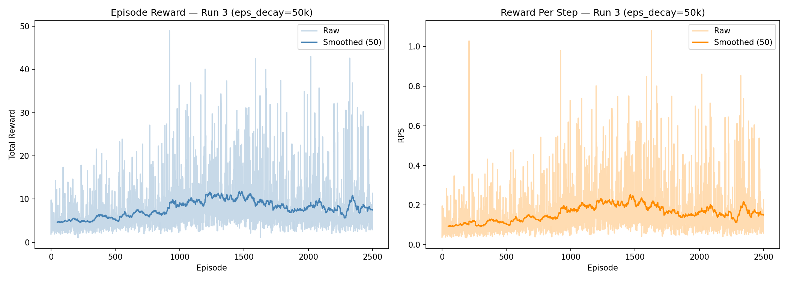
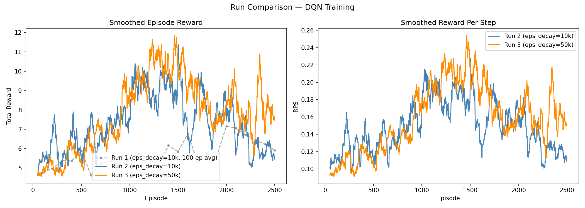

# Assignment 2 (HW2) — Deep Q-Network

## Task

The goal is to train a DQN agent that learns to push a box to a goal position on a tabletop, using only low-dimensional state information. At each timestep the agent receives the end-effector position, object position, and goal position (6 values total), and must choose one of 8 discrete movement directions.

## Implementation

### State and Action Space

Rather than learning from raw pixels, we use `high_level_state`: a 6-dimensional vector `[ee_x, ee_y, obj_x, obj_y, goal_x, goal_y]`. This makes the learning problem much more tractable — the agent can directly reason about spatial relationships without needing to learn visual representations first.

The action space consists of 8 directions uniformly distributed around the unit circle, each applying a 5cm displacement to the end-effector. This discretisation is coarse enough to be learnable but fine enough to express the necessary movements.

### Network Architecture

We use a 3-layer MLP: **6 → 64 → 64 → 8**, outputting one Q-value per action. The network is deliberately simple: with only 6 input dimensions there is no need for convolutional layers or attention mechanisms. Two hidden layers of 64 units are sufficient to represent the non-linear value landscape of this task.

### Why DQN and not plain Q-learning?

Tabular Q-learning is infeasible here because the state space is continuous. DQN approximates the Q-function with a neural network, but this introduces instability: updating the network to reduce Bellman error also shifts the target we are trying to hit. Two mechanisms address this:

- **Replay buffer** (capacity 10 000): stores past transitions and samples random mini-batches, breaking the temporal correlation between consecutive updates that would otherwise make gradient estimates noisy and biased.
- **Target network** with soft update (τ=0.005): a slowly-moving copy of the policy network is used to compute TD targets. Because `target ← τ·policy + (1-τ)·target`, targets shift gradually rather than jumping with every gradient step, stabilising training.

### Optimiser

Adam with lr=1e-4. Adam is preferred over SGD here because the reward signal is noisy and episode lengths vary widely — adaptive per-parameter learning rates help the network learn at a consistent pace even when gradient magnitudes fluctuate.

---

## Experiments

> Run 1 was executed before per-episode CSV logging was added; its metrics come from notebook output.

### Run 1 — Baseline

All hyperparameters set to the provided defaults.

| Param | Value |
|---|---|
| eps_decay | 10 000 steps |
| eps_start → eps_end | 0.9 → 0.05 |
| gamma | 0.99 |
| lr | 1e-4 |
| tau | 0.005 |
| batch_size | 128 |

| Metric | Value |
|---|---|
| Final 100-ep avg reward | 5.92 |
| Peak 100-ep avg reward | ~7.2 |

With `eps_decay = 10 000` steps and a maximum of 50 steps per episode, epsilon reaches its minimum after roughly 200 episodes — just 8% of the total training budget. The agent spends the remaining 2300 episodes in near-greedy mode, exploiting whatever partial strategy it discovered during that narrow exploration window. The reward curve never clearly converges: it fluctuates between 5 and 7 without a sustained upward trend, suggesting the agent settles into a local strategy rather than discovering the full task structure.

---

### Run 2 — Simulation speed check (n_splits=15)

**Change:** `n_splits` reduced from 30 to 15, halving the number of IK sub-steps per action. No hyperparameter changes.

| Metric | Value |
|---|---|
| Final 100-ep avg reward | 5.88 |
| Peak 100-ep avg reward | 10.06 (ep ~1400) |
| Final 100-ep avg RPS | 0.118 |

The reward curve shape is qualitatively similar to Run 1, confirming that halving the simulation resolution does not meaningfully change what the agent learns — it only affects speed. Interestingly, the peak is higher (~10 vs ~7.2), but this likely reflects random variation rather than a systematic effect, since the final performance is almost identical.

A notable pattern appears: the agent peaks around episode 1400 then gradually degrades. This late-training decline coincides with the loss rising above 1.0 around episode 1200–1500. This is a known failure mode of standard DQN — once the policy starts overexploiting a narrow corridor of states, the Q-values in that region inflate without bound, and the network begins to misestimate values in rarely visited states. The result is a policy that becomes more brittle rather than more general.

---

### Run 3 — Extended Exploration (eps_decay=50 000)

**Hypothesis:** The agent's failure to consolidate learning stems from committing to greedy behaviour too early. By extending the exploration period 5×, the replay buffer should contain a more diverse set of transitions when learning begins in earnest, leading to better-calibrated Q-values and a more stable policy.

**Change:** `eps_decay` increased from 10 000 → 50 000 steps (~1 000 episodes instead of ~200).

| Metric | Value |
|---|---|
| Final 100-ep avg reward | **7.79** |
| Peak 100-ep avg reward | **11.25 (ep ~1300)** |
| Final 100-ep avg RPS | **0.156** |

The hypothesis is supported. Both peak and final performance improve meaningfully. The reward rise in the first half is smoother and reaches a higher ceiling. Crucially, performance at the end of training (7.79) is noticeably higher than in Runs 1 and 2 (~5.9), suggesting the agent retains more of what it learned rather than regressing.

The late-training degradation is still present, though less severe. This points to a remaining structural issue: standard DQN tends to overestimate Q-values because the same network is used to both select and evaluate actions. Double DQN — which uses the policy net to select the action and the target net to evaluate it — is the natural next step to address this.

---

## Summary

| Run | eps_decay | Final avg reward | Peak avg reward | Log |
|---|---|---|---|---|
| Run 1 | 10 000 | 5.92 | ~7.2 | notebook output only |
| Run 2 | 10 000 | 5.88 | 10.06 | `src/hw2/hw2_run2_log.csv` |
| **Run 3** | **50 000** | **7.79** | **11.25** | `src/hw2/hw2_run3_log.csv` |

Per-episode reward, RPS, loss and epsilon for Runs 2 and 3 are logged to CSV. Run 1 predates the logging addition; its 100-episode averages are taken from notebook cell output.

The dominant bottleneck in this setting is insufficient exploration early in training. The network architecture and learning rate appear adequate — the agent is capable of achieving reward above 11 — but it needs enough diverse experience before transitioning to exploitation to learn a robust policy. Extending `eps_decay` from 10k to 50k steps improved final performance by **+32%** and peak performance by **+12%**.

The persistent late-training instability suggests that Q-value overestimation is a secondary bottleneck. Addressing it (via Double DQN, gradient clipping, or a larger replay buffer) would likely push performance further.
