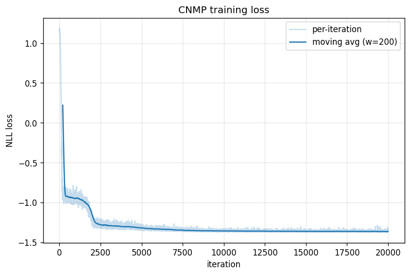
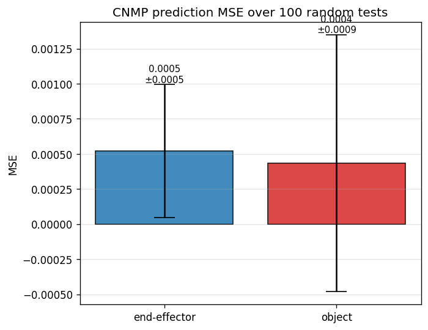

# Assignment 3 (HW4) — Learning from Demonstration with CNMPs

## Task

We collect push demonstrations on a UR5e arm (y–z plane, object with random height `h`) and train a **Conditional Neural Movement Primitive (CNMP)** to reconstruct the full trajectory of the end-effector and the object from a handful of observed points plus the object height. The assignment evaluates how well the model can, given a few `(t, h, e_y, e_z, o_y, o_z)` context samples from a demonstration, predict the remaining `(e_y, e_z, o_y, o_z)` values at any queried time under that same `h`.

## Why CNMPs (and why not plain regression or RL)

A demonstration is a continuous function from time to state. A CNMP models a **distribution over such functions**: the permutation-invariant encoder–aggregator turns an arbitrary number of observed points into a latent representation `r`, and the decoder turns `(r, query)` into a predictive distribution. Two properties make this a natural fit here:

1. **Variable context size.** The number of observed points can change between tests; the aggregator averages over whatever is provided, so a single trained model handles the full range from one-shot to many-shot prediction.
2. **Task conditioning.** `h` is replicated along every query, so the decoder sees it for every target point. The model learns a family of trajectory distributions indexed by `h` instead of a single average trajectory.

Behaviour cloning via a point-wise MLP would have to commit to a fixed input format and would not model uncertainty. A Gaussian Process is the classical alternative, but scales cubically with context size and cannot easily condition on a task parameter without a bespoke kernel. RL is inappropriate — we have demonstrations, no reward signal.

## Data

Script: [`src/hw4/collect_demos.py`](src/hw4/collect_demos.py).

Each episode resets `Hw5Env`, samples a random object height `h ∈ [0.03, 0.10]`, and runs a Bezier trajectory sweep of the end-effector from `y = +0.3` to `y = -0.3`. The two middle control points have random heights, so the arm sometimes passes over the object and sometimes strikes it. For each of the 100 Bezier steps we record `high_level_state() = (e_y, e_z, o_y, o_z, h)`.

The collector stores the positional states as an `(N, T, 4)` array and the heights as `(N,)`, dropping the replicated `h` column since it is constant within an episode. `t` is assigned at load time as `linspace(0, 1, T)` so the query coordinate is dimensionless.

```
trajectories.pt
├── trajectories : float32 (N, T=100, 4)  # (e_y, e_z, o_y, o_z)
└── heights      : float32 (N,)
```

## Model

Script: [`src/hw4/train_cnmp.py`](src/hw4/train_cnmp.py), using the `CNP` class from `src/hw4/homework4.py`. The table below describes the **v1 baseline configuration** (the submission default); v2 and v3 scale `H` and depth — see the Versions table for details.

| Component | Dim (v1) | Notes |
|---|---|---|
| Query `x` | 2 | `[t, h]` — time and object height |
| Target `y` | 4 | `[e_y, e_z, o_y, o_z]` |
| Encoder | `d_x + d_y = 6` → `H = 128` | 3 hidden layers, ReLU |
| Aggregator | mean over context axis | permutation-invariant |
| Decoder | `H + d_x = 130` → `2·d_y = 8` | 3 hidden layers; outputs `(mean, logstd)`, `std = softplus(logstd) + 0.1` |

The decoder emits `(mean, std)` for each target point and the loss is the Gaussian NLL `−log N(y_true | mean, std)`. Predicting `std` gives the model a way to say "I'm not sure" (e.g. object position when the arm never touches the object) without being penalised as heavily as if it had to commit to a point estimate.

### Training loop

- **Iterations:** 20 000, batch size 16.
- **Optimiser:** Adam with lr = 1e-4.
- **Context / target sizes** per iteration: `n_context, n_target ∼ U{1, …, 10}`, independent, resampled every step. Each batch entry shares the same `(n_context, n_target)` so we can use the unmasked path of the CNP.
- **Context/target split:** within each sampled trajectory, we pick a random permutation of the 100 time indices, take the first `n_context` as context and the next `n_target` as targets. Context and target never overlap, which forces the encoder to produce something useful rather than memorising a look-up.

### Training loss

Artifacts: [`src/hw4/training_loss.csv`](src/hw4/training_loss.csv), [`src/hw4/training_loss.png`](src/hw4/training_loss.png).



Starting NLL is about +1.2. The curve shows a first fast drop to around −0.9 within the first few hundred iterations (the model learns the mean trajectory shape), then a brief plateau, then a second descent around iteration 2000–3000 that takes the loss down to roughly −1.30. From ~iteration 5000 onward the loss continues to creep down slowly and stabilises near **−1.364** over the final 500 iterations. Negative NLL is expected here: the predicted `std` values shrink below 1 for the end-effector coordinates (those trajectories are nearly deterministic given `h`), which makes the Gaussian density exceed 1 and `−log N(…)` turn negative. The curve did not flatline at the `min_std = 0.1` floor, so the decoder is using its uncertainty head rather than collapsing it.

## Evaluation

Script: [`src/hw4/evaluate_cnmp.py`](src/hw4/evaluate_cnmp.py).

We run **100 tests**. Each test picks a random trajectory and random `(n_context, n_target)` from `U{1, …, 10}`, samples disjoint index sets as in training, runs the model, and computes per-test MSE separately for the end-effector `(e_y, e_z)` and the object `(o_y, o_z)`. The two groups are averaged and plotted as the two required bars.

Artifacts: [`src/hw4/mse_results.csv`](src/hw4/mse_results.csv), [`src/hw4/mse_barplot.png`](src/hw4/mse_barplot.png).



| Group          | mean MSE  | std MSE   |
|----------------|-----------|-----------|
| end-effector   | 0.000520  | 0.000473  |
| object         | 0.000433  | 0.000914  |

### Reading the result

The two bars have **similar means but very different spreads**: the object's std (0.00091) is roughly 2× the end-effector's (0.00047), and the error bar even crosses zero on the lower side. That gap — not the mean — is the interesting finding. It falls out of the structure of the task:

- The **end-effector trajectory is nearly deterministic given `(t, h)`**. The arm tracks a Bezier sweep whose two middle control points have `z ∼ U[1.04, 1.4]`; the height `h` is independent of the controller. So the learnable mapping `(t, h) → (e_y, e_z)` is approximately a single smooth curve, and the model matches it with a small, evenly-distributed error.
- The **object trajectory is bimodal**. On most tests the arm clears the box and the object never moves — contributing MSE near zero. On a minority of tests the arm clips the box and pushes it some distance; the resulting `(o_y, o_z)` depend on the random middle control points, which are *not* in the model's input — so those tests contribute a relatively large MSE. Averaging a tight-zero-centred mode with a heavy-tailed contact mode gives a low mean but a high variance, which is exactly the pattern observed.

This is also why the object's predictive `std` should be larger than the end-effector's: the model cannot tell from `(t, h)` alone whether a collision will occur, so its best strategy is to emit a wide Gaussian around the expected post-contact distribution. The NLL loss rewards this honesty directly, while a plain MSE head would have no way to express it.

## Versions

The assignment deliverables above use **v1** — the baseline configuration specified by the task. Two further iterations were run afterwards to explore where the model's remaining error comes from; their artifacts are kept next to the v1 files and the full analysis lives in [`src/hw4/experiments.md`](src/hw4/experiments.md).

| Version | Aggregator       | Hidden × Layers | `n_ctx_max` / `n_tgt_max` | Iterations | EE mean MSE | EE std | Obj mean MSE | Obj std |
|---------|------------------|-----------------|---------------------------|------------|-------------|--------|--------------|---------|
| v1      | mean (stock CNP) | 128 × 3         | 10 / 10                   | 20 000     | 0.000520    | 0.000473 | 0.000433   | 0.000914 |
| v2      | mean (stock CNP) | 256 × 5         | 30 / 30                   | 60 000     | 0.000062    | 0.000105 | 0.000103   | 0.000626 |
| v3      | cross-attention  | 256 × 5, 4 heads | 30 / 30                  | 60 000     | 0.000092    | 0.000177 | **0.000035** | **0.000058** |

- **v1** is the submission-facing result. Its bar plot and MSE CSV are the deliverable.
- **v2** is the same CNP architecture with more capacity, more context per update, and longer training. It confirms that most of v1's error is a capacity/context issue for the smooth end-effector channel, and diagnoses the remaining object-side variance as an aggregator problem rather than a capacity problem.
- **v3** replaces the mean aggregator with multi-head cross-attention (`AttentiveCNP` in [`src/hw4/anp.py`](src/hw4/anp.py)) and collapses the object std by roughly 11× relative to v2. It is the answer to the follow-up question "how do we actually learn the object, not just widen the Gaussian around it?".

### Artifacts

All files live under `src/hw4/`:

| File                        | v1 | v2 | v3 |
|-----------------------------|----|----|----|
| trained model               | [`cnmp_model.pt`](src/hw4/cnmp_model.pt) | [`cnmp_model_v2.pt`](src/hw4/cnmp_model_v2.pt) | [`anp_model_v3.pt`](src/hw4/anp_model_v3.pt) |
| training loss (CSV / PNG)   | [`training_loss.csv`](src/hw4/training_loss.csv) / [`training_loss.png`](src/hw4/training_loss.png) | [`training_loss_v2.csv`](src/hw4/training_loss_v2.csv) / [`training_loss_v2.png`](src/hw4/training_loss_v2.png) | [`training_loss_v3.csv`](src/hw4/training_loss_v3.csv) / [`training_loss_v3.png`](src/hw4/training_loss_v3.png) |
| MSE per test (CSV)          | [`mse_results.csv`](src/hw4/mse_results.csv) | [`mse_results_v2.csv`](src/hw4/mse_results_v2.csv) | [`mse_results_v3.csv`](src/hw4/mse_results_v3.csv) |
| MSE bar plot (PNG)          | [`mse_barplot.png`](src/hw4/mse_barplot.png) | [`mse_barplot_v2.png`](src/hw4/mse_barplot_v2.png) | [`mse_barplot_v3.png`](src/hw4/mse_barplot_v3.png) |

Shared: [`trajectories.pt`](src/hw4/trajectories.pt) (the 150 demonstrations — all three versions train on the same data).

The development log — what each iteration changed, why, and what the numbers meant — is in [`src/hw4/experiments.md`](src/hw4/experiments.md).

## Reproducing

Set up the Python environment per the top-level [`README.md`](README.md) (Python 3.9, `mujoco==2.3.2`, `dm_control==1.0.10`, `mujoco-python-viewer`, PyTorch). Then, from the repository root:

```bash
cd src
python hw4/collect_demos.py -n 150 --render-mode offscreen
```

This writes `src/hw4/trajectories.pt`. The three versions then train and evaluate against that same file.

### v1 — baseline (submission default)

```bash
python hw4/train_cnmp.py
python hw4/evaluate_cnmp.py
```

### v2 — larger CNP

(Paths below are relative to `src/` — continuing from the `cd src` used for v1.)

```bash
python hw4/train_cnmp.py \
  --hidden-size 256 --num-hidden-layers 5 \
  --n-context-max 30 --n-target-max 30 \
  --iterations 60000 \
  --model-out hw4/cnmp_model_v2.pt \
  --loss-csv-out hw4/training_loss_v2.csv \
  --loss-plot-out hw4/training_loss_v2.png

python hw4/evaluate_cnmp.py \
  --model hw4/cnmp_model_v2.pt \
  --hidden-size 256 --num-hidden-layers 5 \
  --n-context-max 30 --n-target-max 30 \
  --csv-out hw4/mse_results_v2.csv \
  --plot-out hw4/mse_barplot_v2.png
```

### v3 — Attentive CNP

```bash
python hw4/train_cnmp.py \
  --model-type anp \
  --hidden-size 256 --num-hidden-layers 5 --num-heads 4 \
  --n-context-max 30 --n-target-max 30 \
  --iterations 60000 \
  --model-out hw4/anp_model_v3.pt \
  --loss-csv-out hw4/training_loss_v3.csv \
  --loss-plot-out hw4/training_loss_v3.png

python hw4/evaluate_cnmp.py \
  --model-type anp \
  --model hw4/anp_model_v3.pt \
  --hidden-size 256 --num-hidden-layers 5 --num-heads 4 \
  --n-context-max 30 --n-target-max 30 \
  --csv-out hw4/mse_results_v3.csv \
  --plot-out hw4/mse_barplot_v3.png
```

### Headless machines

On a machine without a display, set these before any script that touches the simulator:

```bash
export MUJOCO_GL=egl
export PYOPENGL_PLATFORM=egl
```

All scripts expose CLI flags (`--hidden-size`, `--iterations`, `--n-tests`, `--seed`, …) with sensible defaults — see `--help`.
