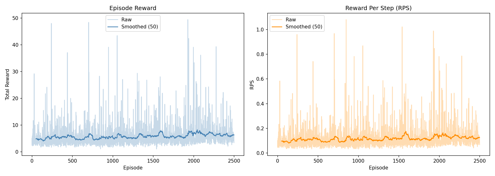
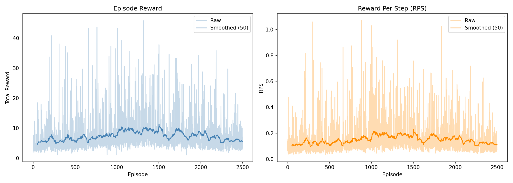

# HW2: Deep Q-Network — Report

## Setup

**Architecture:** MLP `[6 → 64 → 64 → 8]` with ReLU activations, soft target update (τ=0.005), Adam optimizer (lr=1e-4), replay buffer capacity 10 000.

**State:** `high_level_state` — 6-dim vector `[ee_x, ee_y, obj_x, obj_y, goal_x, goal_y]`

**Action space:** 8 discrete directions (uniformly spaced on unit circle, δ=0.05m)

> Note: Run 1 was executed before per-episode CSV logging was added; summary metrics are taken from notebook output.

---

## Run 1 — Baseline

**Hyperparameters:** instructor defaults
| Param | Value |
|---|---|
| memory_size | 10 000 |
| num_episodes | 2 500 |
| batch_size | 128 |
| eps_decay | 10 000 steps |
| eps_start / eps_end | 0.9 / 0.05 |
| gamma | 0.99 |
| lr | 1e-4 |
| tau | 0.005 |

**Results:**

| Metric | Value |
|---|---|
| Final 100-ep avg reward | 5.92 |
| Peak 100-ep avg reward | ~7.2 (ep ~2000) |

**Discussion:**
Epsilon decays to 0.05 after only ~200 episodes (10 000 steps ÷ ~50 steps/ep), leaving the agent in near-greedy mode for 92% of training. The policy improves slowly but never stabilises — reward oscillates between 5–7 throughout. The short exploration window prevents the agent from building a diverse replay buffer before committing to a greedy strategy.

---

## Run 2 — Baseline with logging & n_splits=15

**What changed:** Added CSV logging and reduced `n_splits` from 30 → 15 (halves simulation time). Hyperparameters otherwise identical to Run 1.

**Results:**

| Metric | Value |
|---|---|
| Final 100-ep avg reward | 5.88 |
| Peak 100-ep avg reward | 10.06 (ep 1397) |
| Final 100-ep avg RPS | 0.118 |

**Discussion:**
Reducing `n_splits` to 15 did not meaningfully change training dynamics — reward curve is similar to Run 1, confirming the environment change is neutral for learning. The agent peaks around ep 1400 (~10 avg reward) then degrades back toward ~6. The degradation coincides with loss climbing above 1.0 (ep 1200–1500), suggesting Q-value overestimation as the policy overexploits a narrow region of the state space discovered during early greedy phases.

---

## Run 3 — Extended Exploration (eps_decay=50 000)

**What changed:** `eps_decay` increased from 10 000 → 50 000 steps. This extends the exploration phase from ~200 episodes to ~1 000 episodes, giving the agent more diverse experience before committing to a greedy policy.

**Results:**

| Metric | Value |
|---|---|
| Final 100-ep avg reward | **7.79** |
| Peak 100-ep avg reward | **11.25 (ep 1289)** |
| Final 100-ep avg RPS | **0.156** |

**Discussion:**
Longer exploration produced a measurably better policy. The agent reaches a higher peak reward (11.25 vs 10.06) and sustains higher performance through the end of training (7.79 vs 5.88 final avg). The reward curve is smoother in the first half — the replay buffer is more diverse when the agent transitions to greedy, so early Q-value estimates are better calibrated.

The late-training degradation persists (peak ~1300, then gradual decline), suggesting a structural issue beyond exploration length. Possible causes: Q-value overestimation due to standard DQN (Double DQN would help), or the replay buffer discarding useful early transitions as training progresses.

---

## Summary

| Run | eps_decay | Final avg reward | Peak avg reward | Note |
|---|---|---|---|---|
| Run 1 | 10 000 | 5.92 | ~7.2 | Baseline, no CSV log |
| Run 2 | 10 000 | 5.88 | 10.06 | n_splits=15, CSV logging |
| Run 3 | **50 000** | **7.79** | **11.25** | Extended exploration |

**Key finding:** Extending epsilon decay 5× (10k→50k steps) improved final performance by +32% and peak performance by +12%. The dominant bottleneck in this setting is insufficient exploration early in training, not network capacity or learning rate.
